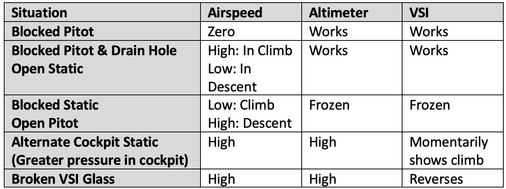

# Aircraft Flight Instruments and Navigation Equipment

## Flight Instrument Systems and Their Operating Characteristics

### Pitot-Static System

* Alternate static source
  * Due to the venturi effect of the air flowing around the fuselage, *the air pressure inside the flight deck is lower* than the exterior pressure.
* Altimeter
  * The indicated altitude is correct, however, only when the sea level barometric pressure is standard (29.92 inHg), the sea level free air temperature is standard (15 &#176;C or 59 &#176;F), and the pressure and temperature decrease at a standard rate with an increase in altitude.
  * Can adjust the altimeter for nonstandard pressure but not temperature
    * True altitude thus varies with temperature
    * Higher temps means true altitude is higher than indicated and lower temps means true altitude is lower than indicated
    * Recall "hot-to-cold look out below"
    * Beware obstacle clearance especially when flying in colder temps
  * Mental model: altimeter setting provides true datum at ground level of the reporting station. Then consider the pressure gradient (which decreases with altitude). Compared to the standard pressure gradient, the pressure gradient in colder more dense air will decrease more quickly, and in hot air the pressure gradient will decrease less quickly.
* Vertical Speed Indicator (VSI)
* Airspeed Indicator (ASI)
  * Lower limits of green and white arc are power-off stall speeds
  * Other speeds not here are, for example, $V_{a}$, $V_{g}$, and $V_{\text{LE}}$
  * The same behavior described by "hot-to-cold look out below" for the altimeter applies to the airspeed indicator as well - when flying to a warmer area, for example, true airspeed will increase (given a constant power setting and true altitude)
* Failure modes

 [Chapter 8: Flight Instruments](https://www.faa.gov/sites/faa.gov/files/regulations_policies/handbooks_manuals/aviation/phak/10_phak_ch8.pdf) Figure 8-1.](../../img/phak/phak-figure-8-1-pitot-static-system.jpg){width=500}

 [Chapter 8: Flight Instruments](https://www.faa.gov/sites/faa.gov/files/regulations_policies/handbooks_manuals/aviation/phak/10_phak_ch8.pdf) Figure 8-2.](../../img/phak/phak-figure-8-2-altimeter.jpg){width=360}

 [Chapter 8: Flight Instruments](https://www.faa.gov/sites/faa.gov/files/regulations_policies/handbooks_manuals/aviation/phak/10_phak_ch8.pdf) Figure 8-5.](../../img/phak/phak-figure-8-5-vertical-speed-indicator.png){width=360}

 [Chapter 8: Flight Instruments](https://www.faa.gov/sites/faa.gov/files/regulations_policies/handbooks_manuals/aviation/phak/10_phak_ch8.pdf) Figure 8-7.](../../img/phak/phak-figure-8-7-airspeed-indicator.png){width=360}

 [Chapter 8: Flight Instruments](https://www.faa.gov/sites/faa.gov/files/regulations_policies/handbooks_manuals/aviation/phak/10_phak_ch8.pdf) Figure 8-8.](../../img/phak/phak-figure-8-8-airspeed-indicator-markings.png){width=360}

{width=400}
